# Udacity's Machine Learning Engineer With Microsoft Azure Capstone Project

## Project Overview 

For Udacity's Machine Learning Engineer with Microsoft Azure Nanodegree capstone project we had to choose a dataset, task, and metric for a machine learning problem, do training with both Azure Hyperdrive and AutoML, register the best models from each, deploy the best performing of the two models, and consume the endpoint.

## Dataset

### Overview

The dataset I chose is the Heart Failure clinical records Data Set that can be found [here](https://archive.ics.uci.edu/ml/datasets/Heart+failure+clinical+records) at the UCI Machine Learning repository.  For the project, I was browsing the UCI machine learning repository for datasets to use as these sets are smaller than ones found on other sites such as data.gov.  After looking through the datasets, this one was of particular interest due to having a family history of heart disease.

The dataset is comprised of 299 records of heart failure patients with 13 attributes and no missing values.  All attributes are numeric consisting of both continuous and discrete values.  

### Task

The dataset was used for supervised learning binary classification with DEATH_EVENT column being the target.  Death event is a boolean value with 0 being there was no death before the follow up and 1, there was a death event. Upon predicting of a possible death event, doctors may want to call patients in for a further checkup or switch medications or dosages.  All parameters were used during training.

### Access

In both notebooks the dataset was read in using Dataset.Tabular.from_delimited_files using the url of that dataset at the UCI machine learning repository site and then registered in Azure if it hadn't been already.

For AutoML the dataset is then converted to a pandas dataframe and split into a train and test set.  The training set is then written to a file and  read into a tabular dataset to send to the experiment using Dataset.Tabular.from_delimited_files.
The training set is used for automl training.
After training the test set is split into x_test and y_test for testing.
Finally during deployment, the first two rows of the test set, excluding DEATH_EVENT, are sent to the endpoint for prediction.

For hyperdrive, the train.py file reads the data in using the url, as was originally done before registering. Then the dataset is converted to a Pandas dataframe, Death Event is popped off and the dataset is split into x and y training and test sets using the same random seed as was used in the automl notebook. 

The x_train and y_train are used to fit the logistic regression model and the x_test and y_test are used to compute accuracy.

## Automated ML

To reduce the time taken to train, experiment_timeout_minutes of 30 and 50 iterations were chosen. In order to utilize more than one node at once, since 4 where allocated, max_concurrent_iterations were set to 4. Early stopping is enabled so if a run is not performing well, it can stop early, again to save time and if not performing well continuing seems uncessary. The local compute was chosen as this may be slower but generally provides better results. Also 5 cross validations were chosen to split the data into 80%/20% train and test sets and help balance variance and bias.

### Results

As can be seen in the Run Details screenshot, the top performing model was a VotingEnsemble with 88% accuracy.  

#### Screenshots: Run Details

The below screenshot shows the rundetails widgit showing the run is completed and the top 5 performing models
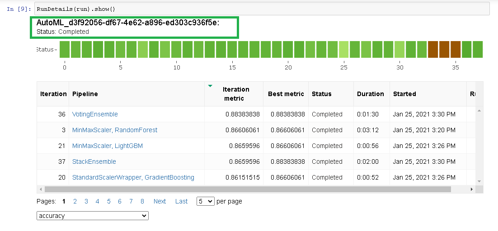

The plot below shows graphs the various accuracies observed during the run.  Most runs registered between 80 and 90 percent accuracy.

#### Screenshots: Model

The screenshot below shows the run information, including the run id and the top part of the model description
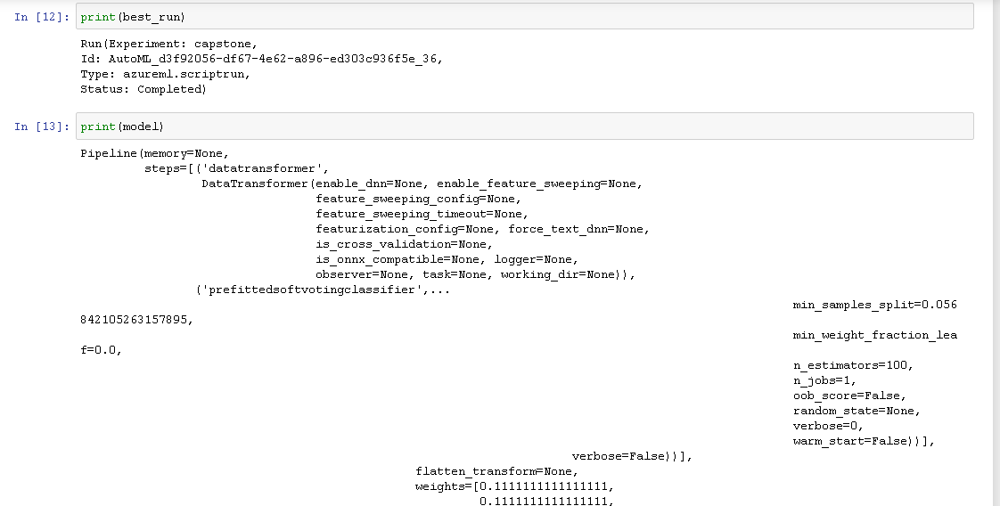

Here is a screenshot showing the entire description of the top performing model
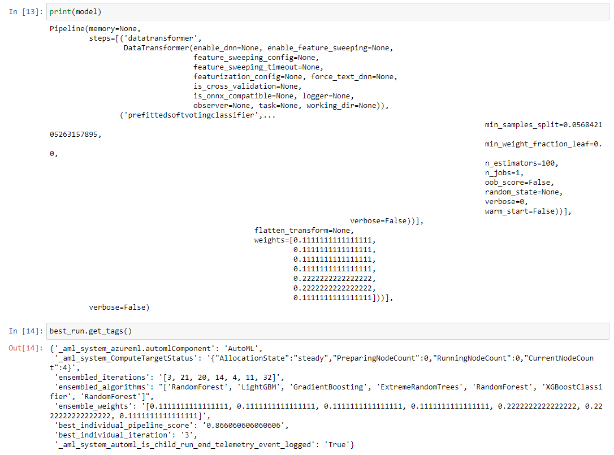

The model performed with 88% accuracy.
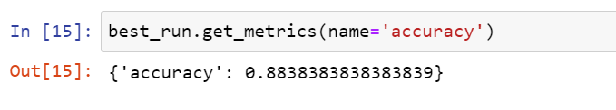

## Hyperparameter Tuning

### Model

As the task is binary classification, I chose to use Scikit-Learn's logistic regression for hyperparameter tuning.  I have used logistic regression before in machine learning courses and am more familiar with it than other supervised learning classification algorithms.

### Hyperparameters chosen to tune

The parameters I chose to tune are 
C: the inverse of the regularization strength; 
solver: what algorithm is used for optimization; 
and, max_iter: max number of iterations to take for the solver to converge.

C has a default value of 1. For the sampler I used the discrete option 'choice' with 1 multiplied and divided by two powers of 10.  Choice was used instead of a continuous sampler to ensure a large variation in the possible regularization strengths used.  

For solver, all possible solver arguments were included in the sample space with the exception of newton-cg as newton-cg can be time consuming. 

Max_iter has a default value of 100. For the sample space I used choice from 50 to 200 in incriments of 25.  Less than 50 iterations may not allow for the convergence of the cost function to a minimum while more than 200 iterations I feel would not be necessary.

These three parameters were chosen for tuning as other parameters relied on which solver was used.

### Settings

RandomParameterSampling was chosen instead of Grid as it uses less time and resources and produces almost as good hyperparameters as using Grid. 
A MedianStoppingPolicy was chosen with an evaluation_interval of 1 and delay_evaluation of 5 as this is a conservative policy without loss on the primary metric, according to Microsoft documentation. 
The training is done on the local compute target. 
Accuracy was chosen as the primary metric (although thinking back I should have used recall) with a goal to maximize accuracy. 
To keep training short, max_total_runs was set to 50 and max_duration_minutes was set to 30.

### Results

From the hyperdrive run the best model scored accuracy of 81% with hyperparameter values of C: 1, max_iter: 50, and solver: lbfgs.

#### Screenshots: Run Details

Below shows the screenshot of Run Details widget showing the run as completed.

The following screenshot lists the top 5 models all having accuracy of greater than or equal to 80%.
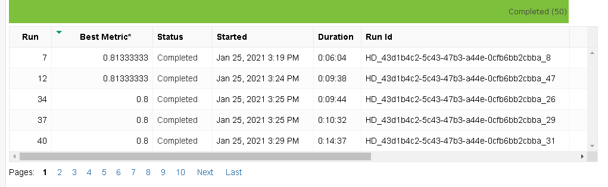

The screenshot below displays the accuracy of the runs.  Accuracy was split into two groups, one group being between 73 and 82 percent, the other group having accuracy below 66%.  This may be due to the median stopping policy.
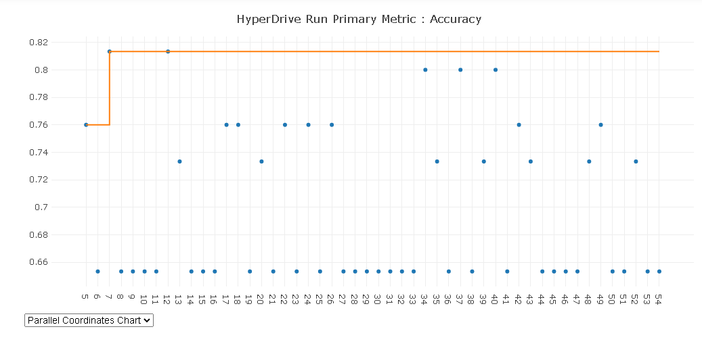

The following screenshot displays performance of various hyperparameter configurations.  Most configurations performed the same with the exception of the one having a C value of 0.01
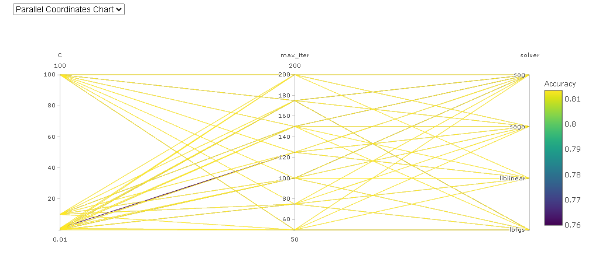

#### Screenshots: Model

The screenshot below shows the run information, including run id, hyperparameter values and accuracy of the best model.
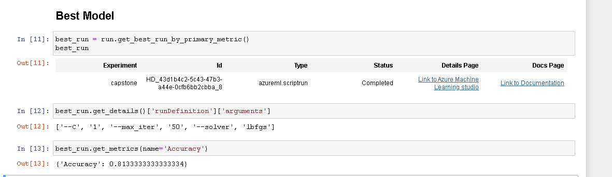

## Model Deployment

With the automl model having accuracy of 88% compared to the hyperdrive model accuracy of 81%, this model was chosen for deployment.

After saving the environment and dowloading the scoring script used during training, the model was deployed locally.  I decided to first deploy locally so that if deployment failed, debugging would be easier.
Then the model was deployed as a webservice using Azure Container Instances.

In order to use the service, the request must be sent in json format to the url (see screenshot below).

From the scoring file you can see the data types expected for each value:
> input_sample = pd.DataFrame({"age": pd.Series([0.0], dtype="float64"), "anaemia": pd.Series([0], dtype="int64"), "creatinine_phosphokinase": pd.Series([0], dtype="int64"), "diabetes": pd.Series([0], dtype="int64"), "ejection_fraction": pd.Series([0], dtype="int64"), "high_blood_pressure": pd.Series([0], dtype="int64"), "platelets": pd.Series([0.0], dtype="float64"), "serum_creatinine": pd.Series([0.0], dtype="float64"), "serum_sodium": pd.Series([0], dtype="int64"), "sex": pd.Series([0], dtype="int64"), "smoking": pd.Series([0], dtype="int64"), "time": pd.Series([0], dtype="int64")})
> output_sample = np.array([0])

The json format for the data can be seen in the Swagger schema (see screenshot below).
Authentication is not required.

To test deployment, I took the first two rows of the test set, excluding DEATH_EVENT, and sent it to the endpoint.  The result prediction for both was 0, meaning false, no predicted death before follow up.

### Screenshots: Endpoint In Active State

Screenshot showing the endpoints section of Azure ML Studio
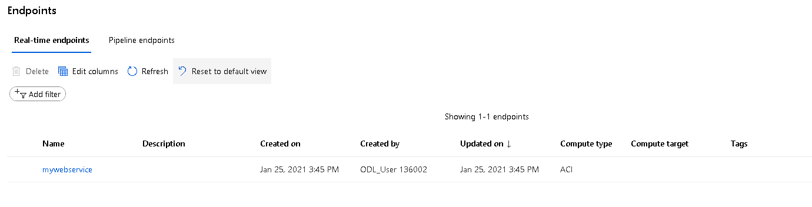

Screenshot showing the endpoint as active
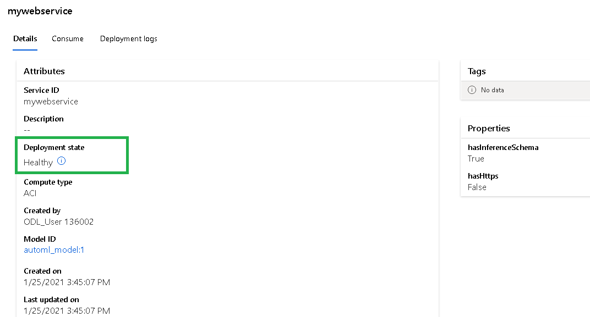

### Screenshots: Swagger Schema for Endpoint
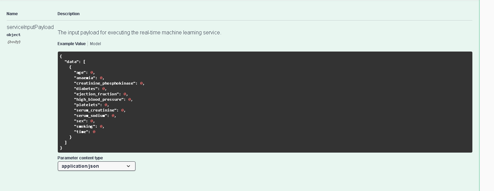
The above screen shows the required json format for a post request. 

### Screenshots: URL
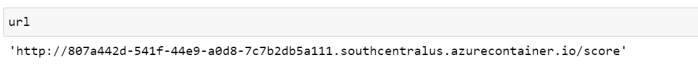
The above screenshot shows the url for querying the endpoint.

### Screenshot: Call to endpoint and result
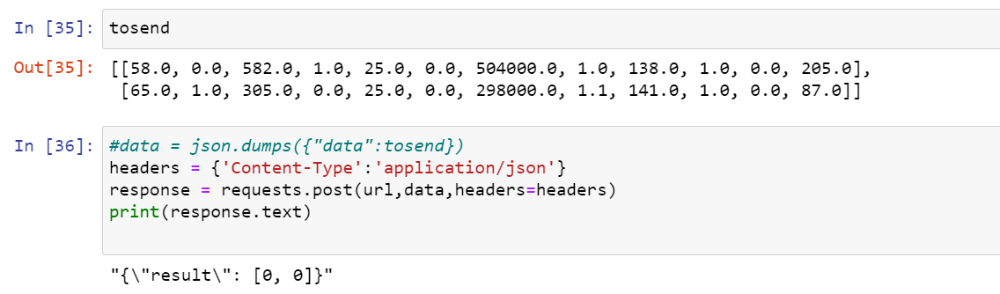
The above screenshot shows the data being sent, the request, and the result.
Just a note, in my notebook the reason the json.dumps was commented out was because this was already done when testing local deployment. 

## Screen Recording

[https://youtu.be/wbC8YtjXAx4](https://youtu.be/wbC8YtjXAx4)

## Suggestions

* Require authentication to access the endpoint
To avoid attacks against the endpoint, authorization should be required.
 
* Use recall instead of accuracy for the primary metric
With DEATH_EVENT being the y value, recall should be used as the primary metric instead of accuracy as a false negative is literally deadly.  I plan to change this in the near future but because the end of the nanodegree is near, I am keeping accuracy as the primary metric when submitting my capstone.

* Hyperdrive: Exploratory data analysis and feature selection
Other than using every attribute, an exploratory data analysis with feature selection prior to training would improve the HyperDrive performance.  Having taken a course in linear regression, I know how to determine what features to include or exclude for linear regression models.  However I am presently uncertain how to do feature selection for classificcation problems.  

* Hyperdrive: Test the model before registering it
Being uncertain of how to retrieve the model from a hyperdrive run before registering it, no testing of the model was done.  It is always a good idea to test the model before registering, as was done with Auto ML.  I need to research how to retrieve the model so it can be tested. 

* AutomatedML: Enable the use of deep neural networks
For greater variety, usage of deep neural networks should be enabled.

* Enable Application Insights
In order to examine the usage and performance of the endpoint, application insighs should be enabled.
